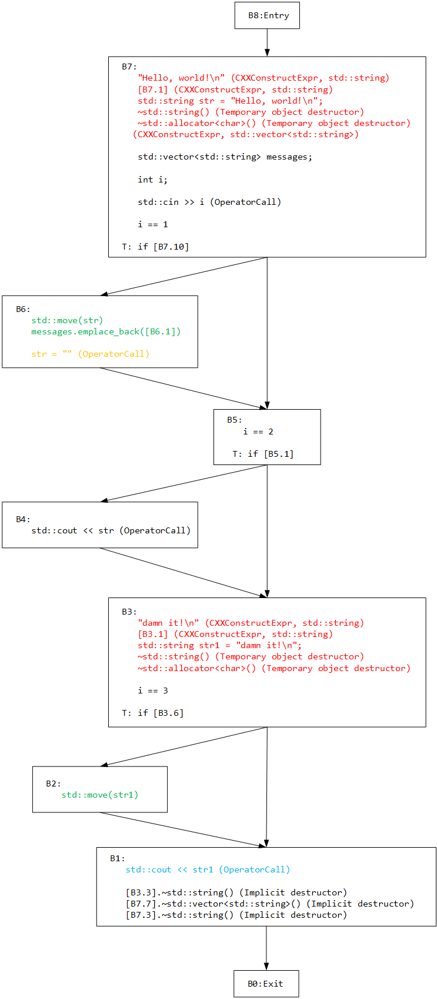

我实现的checker主要以libtooling的方式进行，llvm-project下有示例代码[clang-check](https://github.com/llvm/llvm-project/blob/llvmorg-12.0.0/clang/tools/clang-check/ClangCheck.cpp)，不过**CMakeLists.txt**中 `add_clang_tool` 和 `clang_target_link_libraries` 属于外部导入的命令，而且clang的API太多了，一个个有点看不过来，个人认为实现checker是一个比较好的学习方式。

# 用法

编译好后用 `ASTMatcher testfile -checker=xxx` 即可。比如 `ASTMatcher Long.cpp -checker=LAC`。
如果需要引入外部include路径，添加参数`-Iinclude_path`，比如UseAfterMove： `ASTMatcher IfMove.cpp -checker=UAM -- -I$LLVM_DIR/lib/clang/12.0.0/include`

# clang API

我对clang的API还没有很深入的研究，现在写的Checker也只是照着别人的画瓢，边写边研究。

实现libtooling首先得写**CMakeLists.txt**，我的CMakeLists.txt代码如下（Clion构建的），这里我没有设置 `LLVM_DIR` 这个环境变量，直接在CMakeLists中设置：

```
cmake_minimum_required(VERSION 3.20)
project(ASTMatcher)

set(CMAKE_CXX_STANDARD 14)

# ${LLVM_PACKAGE_VERSION}: 12.0.0
set(LLVM_DIR llvm_path)

set(CMAKE_EXPORT_COMPILE_COMMANDS ON)
add_compile_options(
        "$<$<CXX_COMPILER_ID:GNU,Clang,AppleClang>:-fno-rtti;-Wall>"
        "$<$<AND:$<CXX_COMPILER_ID:GNU>,$<CONFIG:DEBUG>>:-fno-omit-frame-pointer>"
)

set(CMAKE_RUNTIME_OUTPUT_DIRECTORY "${PROJECT_BINARY_DIR}/bin")
find_package(LLVM REQUIRED CONFIG HINTS ${LLVM_DIR})
message(STATUS "Found LLVM ${LLVM_PACKAGE_VERSION}")
message(STATUS "Using LLVMConfig.cmake in: ${LLVM_DIR}")
list(APPEND CMAKE_MODULE_PATH "${LLVM_CMAKE_DIR}")
include(AddLLVM)


# Now set the LLVM header and library paths:
include_directories(SYSTEM ${LLVM_INCLUDE_DIRS})
link_directories(${LLVM_LIBRARY_DIRS})
add_definitions(${LLVM_DEFINITIONS})


include_directories(${CMAKE_CURRENT_BINARY_DIR})
add_executable(ASTMatcher main.cpp)

############## FINAL PROJECT CONFIG #################
if (LLVM_ENABLE_ASSERTIONS)
    add_definitions(-DLLVM_ENABLE_ASSERTIONS=${LLVM_ENABLE_ASSERTIONS})
endif()


target_link_libraries(ASTMatcher
        PRIVATE
        -Wl,--start-group
        clangAST
        clangBasic
        clangDriver
        clangFrontend
        clangIndex
        clangLex
        clangSema
        clangSerialization
        clangTooling
        clangFormat
        clangToolingInclusions
        clangToolingCore
        clangRewriteFrontend
        clangStaticAnalyzerFrontend
        clangCrossTU
        clangStaticAnalyzerCheckers
        clangStaticAnalyzerCore
        clangParse
        clangEdit
        clangRewrite
        clangAnalysis
        clangASTMatchers
        clangTransformer
        ${REQ_LLVM_LIBRARIES}
        -Wl,--end-group
)


find_package(Threads REQUIRED)
find_package(Curses REQUIRED)


set_target_properties(ASTMatcher
        PROPERTIES
        LINKER_LANGUAGE CXX
        PREFIX ""
        )

install(TARGETS ASTMatcher
        RUNTIME DESTINATION bin
        )

```

然后是主函数部分，可以按如下模板进行

```c++
int main(int argc, const char** argv) {
    clang::tooling::CommonOptionsParser op(argc, argv, SelfDefinedCategory);
    clang::tooling::ClangTool tool{op.getCompilations(), op.getSourcePathList()};
    int status = tool.run(clang::tooling::newFrontendActionFactory<SelfDefinedAction>().get());
    return status;
}
```

其中 `SelfDefinedAction` 和 `SelfDefinedCategory` 需要自己改，参考 [LACommenter.h](https://github.com/banach-space/clang-tutor/blob/main/include/LACommenter.h) 和 [LACommenter.cpp](https://github.com/banach-space/clang-tutor/blob/main/tools/LACommenterMain.cpp)。

`Category`可以用一行简单的代码盖过 `static llvm::cl::OptionCategory LACCategory("lacommenter options");`

而 `Action` 需要开发者继承 `PluginASTAction` 类

```c++
class LACPluginAction : public PluginASTAction {

public:

bool ParseArgs(const CompilerInstance &CI,

const std::vector<std::string> &args) override {

return true;

}

std::unique_ptr<ASTConsumer> CreateASTConsumer(CompilerInstance &CI,

StringRef file) override {

LACRewriter.setSourceMgr(CI.getSourceManager(), CI.getLangOpts());

return std::make_unique<LACommenterASTConsumer>(LACRewriter);

}

private:

Rewriter LACRewriter;

};
```

`CreateASTConsumer` 方法中创建自定义 `ASTConsumer` 指针并调用。而 `ASTConsumer` 则通过 Visitor 或者 Matcher方式完成AST的匹配。


# AST匹配部分

AST匹配部分参考[clang-tutor](https://github.com/banach-space/clang-tutor)。实现AST checker有2种方式，Visitor和Matcher

- Visitor方式比较原始，开发者编写类继承 `RecursiveASTVisitor` 类实现对某一些AST结点的访问，`ASTConsumer` 可以调用自定义Visitor。比如tutor中的[HelloWorld](https://github.com/banach-space/clang-tutor/blob/main/HelloWorld/HelloWorld.cpp) 只重写了 VisitCXXRecordDecl 方法来实现访问 `CXXRecordDecl` 结点（这个结点包含了类定义，函数定义和联合体定义）从而实现用户自定义类，函数，联合体的**计数**。[CodeStyleChecker](https://github.com/banach-space/clang-tutor/blob/main/lib/CodeStyleChecker.cpp) 通过访问 `VarDecl， FieldDecl, CXXRecordDecl, FunctionDecl` 这些结点查看用户自定义的identifier是否违反**命名规范**，这类方式的缺点就是只能单独访问结点，当需要考虑上下文情况时很复杂， 参考 [blog](https://blog.csdn.net/qq_23599965/article/details/94402199)。

- Matcher方式相对来说比较高效，可以用来查找满足指定模式的AST结点。比如在[Obfuscator](https://github.com/banach-space/clang-tutor/blob/main/lib/Obfuscator.cpp)中通过下面代码来查找整型加法操作，其中匹配到的AST根节点类型是`BinaryOperator`，满足左操作数和右操作数要么是整型变量要么是整型常量。Matcher的使用方式相对复杂，首先开发者需要自定义 `Handler` 继承 `MatchFinder::MatchCallback`，重写 `run` 方法，将 `Handler` 与对应的match表达式添加到`MatcherFinder` 对象中， 通过`MatcherFinder` 对象匹配AST。可以参考[Obfuscator](https://github.com/banach-space/clang-tutor/blob/main/lib/Obfuscator.cpp)的代码。

```c++
const auto MatcherAdd =
                binaryOperator(
                        hasOperatorName("+"),
                        hasLHS(anyOf(implicitCastExpr(hasType(isSignedInteger())).bind("lhs"),
                                     integerLiteral().bind("lhs"))),
                        hasRHS(anyOf(implicitCastExpr(hasType(isSignedInteger())).bind("rhs"),
                                     integerLiteral().bind("rhs"))))
                        .bind("op");
```


在开发checker过程中可以通过clang-query工具验证上面的match表达式。

被测样本代码int_add.cpp

```c++
//
// Created by xxx on 2022/2/6.
//

int foo(int a, int b) {
    return a + b;
}

short bar(short a, short b) {
    return a + b;
}

long bez(long a, long b) {
    return a + b;
}

int fez(long a, short b) {
    return a + b;
}

int fer(int a) {
    return a + 123;
}

int ber() {
    return 321 + 123;
}
```

命令行操作

```bash
clang-query int_add.cpp
clang-query> match binaryOperator(hasOperatorName("+"),hasLHS(anyOf(implicitCastExpr(hasType(isSignedInteger())).bind("lhs"),integerLiteral().bind("lhs"))),hasRHS(anyOf(implicitCastExpr(hasType(isSignedInteger())).bind("rhs"),integerLiteral().bind("rhs")))).bind("op")
```

匹配结果：
```bash
Match #1:

int_add.cpp:6:12: note: "lhs" binds here
    return a + b;
           ^
int_add.cpp:6:12: note: "op" binds here
    return a + b;
           ^~~~~
int_add.cpp:6:16: note: "rhs" binds here
    return a + b;
               ^
int_add.cpp:6:12: note: "root" binds here
    return a + b;
           ^~~~~

Match #2:

int_add.cpp:10:12: note: "lhs" binds here
    return a + b;
           ^
int_add.cpp:10:12: note: "op" binds here
    return a + b;
           ^~~~~
int_add.cpp:10:16: note: "rhs" binds here
    return a + b;
               ^
int_add.cpp:10:12: note: "root" binds here
    return a + b;
           ^~~~~

Match #3:

int_add.cpp:14:12: note: "lhs" binds here
    return a + b;
           ^
int_add.cpp:14:12: note: "op" binds here
    return a + b;
           ^~~~~
int_add.cpp:14:16: note: "rhs" binds here
    return a + b;
               ^
int_add.cpp:14:12: note: "root" binds here
    return a + b;
           ^~~~~

Match #4:

int_add.cpp:18:12: note: "lhs" binds here
    return a + b;
           ^
int_add.cpp:18:12: note: "op" binds here
    return a + b;
           ^~~~~
int_add.cpp:18:16: note: "rhs" binds here
    return a + b;
               ^
int_add.cpp:18:12: note: "root" binds here
    return a + b;
           ^~~~~

Match #5:

int_add.cpp:22:12: note: "lhs" binds here
    return a + 123;
           ^
int_add.cpp:22:12: note: "op" binds here
    return a + 123;
           ^~~~~~~
int_add.cpp:22:16: note: "rhs" binds here
    return a + 123;

int_add.cpp:22:12: note: "root" binds here
    return a + 123;
           ^~~~~~~

Match #6:

int_add.cpp:26:12: note: "lhs" binds here
    return 321 + 123;

int_add.cpp:26:12: note: "op" binds here
    return 321 + 123;
           ^~~~~~~~~
int_add.cpp:26:18: note: "rhs" binds here
    return 321 + 123;
                 ^~~
int_add.cpp:26:12: note: "root" binds here
    return 321 + 123;
           ^~~~~~~~~
6 matches.
```

# UseAfterMoveCheck

这个Checker是从[llvm-project](https://github.com/llvm/llvm-project/tree/llvmorg-12.0.0/) 中的[clang-tidy]((https://github.com/llvm/llvm-project/tree/llvmorg-12.0.0/clang-tools-extra/clang-tidy))搬运过来的，之所以搬运是因为这个checker不是简单的进行ASTMatcher，还综合了CFG进行分析，个人认为是个熟悉clang CFG的好示例。

## 问题概述

C++中API  `std::move` 的功能是将某个变量的值移动出去，该Checker的作用是对在 `move` 之后使用的变量报出 `warning`，但是如果 `move` 之后该变量重新赋值了那就不报错。

下面代码片段会报错，第3行 `cout` 了一个被 `move` 的变量 `str`。

```c++
std::string str = "Hello, world!\n";
std::move(str);
std::cout << str << endl;
```

而下面代码片段不会报错，因为 `cout` 之前有重新赋值操作。

```c++
std::string str = "Hello, world!\n";
std::move(str);
str = "111";
std::cout << str << endl;
```

这个Checker的检测过程大致分为以下步骤

- 在AST上通过 `ASTMatcher` 搜索出与 `std::move` 相关的语句`MovingCall`以及 `move` 的变量 `MovedVariable`。

- 针对每一个 `move` 操作，Checker首先根据AST构建CFG，在CFG中以包含 `MovingCall` 的block为source点，进行深度优先遍历，遍历过程中如果某一个block存在对 `MovedVariable` 的使用遍返回 `True`。


## 示例

### 代码

```c++
//
// Created by xxx on 2022/2/11.
//

#include<iostream>
#include<vector>
#include<string>

void func(){
    std::string str = "Hello, world!\n"; // Move Variable 1
    std::vector<std::string> messages;
    int i;
    std::cin >> i;
    if (i == 1) {
        messages.emplace_back(std::move(str)); //MovingCall 1
        str = "";
    }

    if (i == 2) {
        std::cout << str;
    }

    std::string str1 = "damn it!\n"; // MoveVariable 2
    if (i == 3){
        std::move(str1); // MovingCall 2
    }
    std::cout << str1;
}
```


### AST

AST太复杂了，这里挑些重点放上（有删减）：

所有的 `MovingCall` 与 `MovedVariable`。`MovingCall` 表示调用 `std::move()` 的语句的AST根节点，`MovedVariable` 表示被move的变量定义位置的AST根节点。

第一对

`MovingCall` 对应  `messages.emplace_back(std::move(str));`

```
CXXMemberCallExpr 0x346f4c0 'void'
|-MemberExpr 0x346f478 .emplace_back 0x346f378
| `-DeclRefExpr 0x346e710 'std::vector<std::string>':'class 'messages' 
`-CallExpr 0x346f1c0 
  |-ImplicitCastExpr 0x346f1a8 
  | `-DeclRefExpr 0x346ef78 Function 'move' 
  `-DeclRefExpr 0x346e7f8 'std::string':'class 'str'
```

`MovedVariable` 对应 `std::string str = "Hello, world!\n";`

```
VarDecl 0x344b2f8 used str 
`-ExprWithCleanups 0x344b530  
  `-CXXConstructExpr 0x344b500 
    `-MaterializeTemporaryExpr 0x344b4e8 
      `-CXXBindTemporaryExpr 0x344b4c8  
        `-ImplicitCastExpr 0x344b4a8 
          `-CXXConstructExpr 0x344b470 
            |-ImplicitCastExpr 0x344b388 
            | `-StringLiteral 0x344b360 "Hello, world!\n"
            `-CXXDefaultArgExpr 0x344b450 
```


第二对

`MovingCall` 对应  `std::move(str1);`

```
CallExpr 0x347c0a8 
|-ImplicitCastExpr 0x347c090 
| `-DeclRefExpr 0x347c058 'move'
`-DeclRefExpr 0x347c000 'std::string':'class 'str1' 
```

`MovedVariable` 对应 `std::string str = "damn it!\n";`

```
VarDecl 0x344b2f8 used str 
`-ExprWithCleanups 0x344b530  
  `-CXXConstructExpr 0x344b500 
    `-MaterializeTemporaryExpr 0x344b4e8 
      `-CXXBindTemporaryExpr 0x344b4c8  
        `-ImplicitCastExpr 0x344b4a8 
          `-CXXConstructExpr 0x344b470 
            |-ImplicitCastExpr 0x344b388 
            | `-StringLiteral 0x344b360 "damn it!\n"
            `-CXXDefaultArgExpr 0x344b450 
```


### CFG

ViewCFG的输出

```
[B8 (ENTRY)]
   Succs (1): B7

 [B1]
   1: std::cout << str1 (OperatorCall)
   2: [B3.3].~std::string() (Implicit destructor)
   3: [B7.7].~std::vector<std::string>() (Implicit destructor)
   4: [B7.3].~std::string() (Implicit destructor)
   Preds (2): B2 B3
   Succs (1): B0

 [B2]
   1: std::move(str1)
   Preds (1): B3
   Succs (1): B1

 [B3]
   1: "damn it!\n" (CXXConstructExpr, std::string)
   2: [B3.1] (CXXConstructExpr, std::string)
   3: std::string str1 = "damn it!\n";
   4: ~std::string() (Temporary object destructor)
   5: ~std::allocator<char>() (Temporary object destructor)
   6: i == 3
   T: if [B3.6]
   Preds (2): B4 B5
   Succs (2): B2 B1

 [B4]
   1: std::cout << str (OperatorCall)
   Preds (1): B5
   Succs (1): B3

 [B5]
   1: i == 2
   T: if [B5.1]
   Preds (2): B6 B7
   Succs (2): B4 B3

 [B6]
   1: std::move(str) # use
   2: messages.emplace_back([B6.1]) # use
   3: str = "" (OperatorCall) # reinit, use
   Preds (1): B7
   Succs (1): B5

 [B7]
   1: "Hello, world!\n" (CXXConstructExpr, std::string)
   2: [B7.1] (CXXConstructExpr, std::string)
   3: std::string str = "Hello, world!\n";
   4: ~std::string() (Temporary object destructor)
   5: ~std::allocator<char>() (Temporary object destructor)
   6:  (CXXConstructExpr, std::vector<std::string>)
   7: std::vector<std::string> messages;
   8: int i;
   9: std::cin >> i (OperatorCall)
  10: i == 1
   T: if [B7.10]
   Preds (1): B8
   Succs (2): B6 B5

 [B0 (EXIT)]
   Preds (1): B1
```

CFG图示如下：



- CFG中每个结点对应一个 `CFGBlock`，`CFGBlock` 中每一行表达式对应一个 `CFGElem`。

- 可以看到CFG中有的语句（`Stmt`）被拆分成了几个子表达式（`sub-Expr`，`CFGElem`）。

## 检测步骤

### 算法大致流程

- 首先算法每次处理一个 `<MovingCall,MovedVariable>` 对。图中有2个对，分别是变量 `str` 和变量 `str1`。

- 针对每个 `<MovingCall,MovedVariable>`， 算法从包含 `MovingCall` 的 `CFGBlock` （第一个是 `MovingCall` Block）开始深度优先搜索。

- 针对每个Block，算法找出该Block中 `MovedVariable` 所有使用（`use`）和重新定义（`reinit`）的位置，如果该block中有 `use` 位置，那么算法会遍历每个 `use` ，查找在 `MovingCall` 和 `use` 中间是否有 `reinit`，没有的话报出warning，返回 `true` 。然后如果该结点中不存在需要报出的情况并且没有 `reinit` 位置，接着深度优先遍历后续block，有的话返回 `false`。


那么检测上面代码第一个 `<MovingCall，MovedVariable>` 对的时候，算法从B6开始遍历，在第一个Block中,  `str` 变量不存在 `use` 情况，但是在下面存在 `reinit`（`str = ""`），因此直接返回 `false`。

而第二处算法从B2开始遍历，在第一个Block中并没有找到 `use` 和`reinit`，而在之后一个Block B1中找到了 `use`（`std::cout << str1`），并且在之前并没有 `reinit`，因此返回 `true`。

结果如下：
```
complexMove.cpp:27:18: warning: variable used after it was moved
    std::cout << str1;
                 ^
complexMove.cpp:25:9: warning: move occurred here
        std::move(str1); // MovingCall 2
        ^
2 warnings generated.
```


### 代码

clang的API有点庞大，我对此也没有深入研究，很多东西都是推测出的，欢迎大佬们补充。


整个检测的API调用链大致是 `ASTConsumer::HandleTranslationUnit` -> `MatchFinder::match(Ctx)`（匹配所有的 `MovingCall` 和`MovedVariable`） -> `MatchFinder::MatchCallback::run`（针对每个匹配到的 `MovingCall` 和 `MovedVariable` 进行检测）-> `UseAfterMoveFinder::find` （从AST建立CFG进行遍历）-> `UseAfterMoveFinder::findInternal` 深度优先遍历。

具体代码可以参考 [llvm project clang-tidy](https://github.com/llvm/llvm-project/tree/llvmorg-12.0.0/clang-tools-extra/clang-tidy) 中的 [UseAfterMoveCheck](https://github.com/llvm/llvm-project/blob/llvmorg-12.0.0/clang-tools-extra/clang-tidy/bugprone/UseAfterMoveCheck.h)，这里它们还用到了一些 [util](https://github.com/llvm/llvm-project/blob/llvmorg-12.0.0/clang-tools-extra/clang-tidy/utils/ExprSequence.h)

其中定义了2个类（我的解读可能比较片面，欢迎大家补充）

- `ExprSequence`：这个类主要是用来判定一个Expr是否在另一个Expr后面，用到的API有`inSequence` 和 `potentiallyAfter`，这2个API基本等价。这个顺序的判定类似于后序遍历: 父节点最后，左子节点优先于右子节点。

```
Expr4
 -- EXpr2
   -- Expr1
 -- Expr3
Expr5 
```

- `StmtToBlockMap`，将一个AST `Stmt` 结点映射到对应的`CFGBlock` 。主要用到了 `blockContainingStmt` 函数来判定一个`CFGBlock` 是否包含这个 `Stmt`。


UseAfterMove的检测过程大致如上，这个检测主要是通过ASTMatcher找到潜在的Source点和Sink点，映射到CFG上，再尝试从Source点遍历到Sink点。

这里也可能产生一些误报，比如上面的CFG中，3个 `if` 条件最多只有1个可以为 `True`。加入没有用 `str="";` 来进行重新赋值，那么checker会对 `messages.emplace_back(std::move(str));` 产生误报。官方对此的解释是这个checker是**flow-sensitive**的但不是**path-sensitive**的。

最后，clang libtool在解析代码时如果代码有 ``#include<xxx>`` 时可能会报错，这是由于clang对c语言标准库的搜索路径存在的问题导致的，可以命令行输入 `echo | clang -v -x c++ -E -` 查看`#include <...>` 搜索路径。不足的可以添加到环境变量也可以在运行libtool时，在filename后添加`-- -Iinclude_path`（include_path是文件夹路径）来添加。完整的命令格式为 `libtool testfile -- -Iinclude_path`
